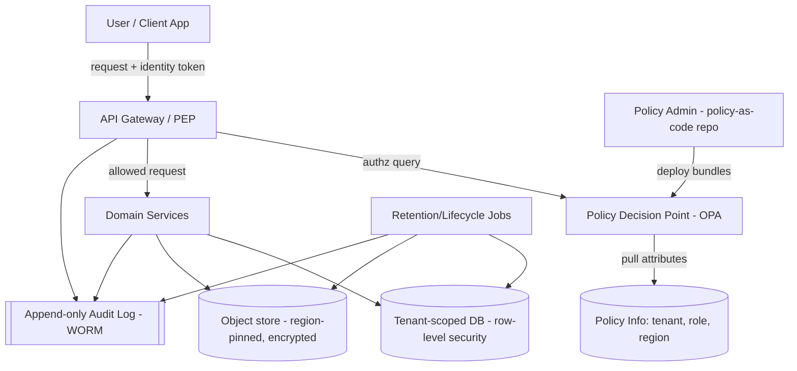

# Governance-Driven System Design (GDD)

> **📌 Source of Truth:** The authoritative record of these decisions is the ADR log in
> [`docs/adr/`](../adr/README.md). Where this document and an **Accepted ADR** disagree,
> **the ADR wins** — this doc is narrative context; the ADRs are the decisions.

### A worked example: a multi-tenant records/documents SaaS ("RecordsHub")

> **Interpretation note.** "Governance-Driven Development" is not a single standardized
> methodology (unlike TDD/DDD/BDD). Here it means: **treat governance concerns —
> policy, compliance, access, data stewardship, auditability, risk controls — as
> first-class architectural drivers.** You derive the system *from* the governance
> model, encode policy *as code*, and enforce it across the whole lifecycle rather
> than adding controls after the fact. Swap the example domain for your own app and
> the method still holds.

---

## 1. The core idea in one line

```
Governance objectives → Policies → Controls → Architectural mechanisms
        → Enforcement points → Evidence (audit) → back to objectives
```

Every architectural decision should trace back to a governance objective, and every
governance objective should have a concrete, testable enforcement mechanism.

---

## 2. Step 1 — Establish the governance model FIRST

This is what makes the approach "governance-driven": you write this before drawing
any boxes.

### 2.1 Governance objectives (example)
- **G1 – Confidentiality:** tenants can never see each other's data.
- **G2 – Least privilege:** users access only what their role/attributes allow.
- **G3 – Data residency:** EU-tenant data stays in EU regions.
- **G4 – Retention & disposal:** records are kept and destroyed per policy.
- **G5 – Auditability:** every sensitive action is provable after the fact.
- **G6 – Change control:** no code/infra reaches prod without policy checks.

### 2.2 Policy catalog

| ID | Policy | Owner | Enforced by |
|----|--------|-------|-------------|
| P1 | Tenant isolation | Security | Row-level security + PDP checks |
| P2 | RBAC + ABAC access | Security | Policy engine (OPA) at each API call |
| P3 | Data residency by tenant region | Compliance | Region-pinned storage + routing |
| P4 | Retention schedule per record class | Legal | Lifecycle jobs + immutable metadata |
| P5 | Immutable audit trail | Compliance | Append-only audit log (WORM) |
| P6 | Change governance gates | Eng Lead | CI/CD policy gates |

### 2.3 Decision rights (who can change what)
- **Policy authors:** Security/Legal/Compliance own the *policy* repo.
- **Engineers:** own implementation, but cannot merge changes that fail policy gates.
- **Auditors:** read-only access to audit log + evidence, no write path.

### 2.4 Data classification scheme
Every record carries a classification label that drives handling:

| Class | Example | Encryption | Retention | Export |
|-------|---------|-----------|-----------|--------|
| Public | marketing docs | at rest | none | allowed |
| Internal | ops records | at rest | 3y | restricted |
| Confidential | contracts | at rest + field-level | 7y | logged + approved |
| Regulated | financial/PII | field-level + KMS | policy-defined | blocked by default |

---

## 3. Step 2 — Derive requirements from governance (traceability)

| Governance | Derived system requirement |
|-----------|----------------------------|
| G1, P1 | Every query is tenant-scoped; isolation testable in CI |
| G2, P2 | Central policy decision on every request; deny-by-default |
| G3, P3 | Storage + compute region selected from tenant metadata |
| G4, P4 | Records carry `class`, `created_at`, `retain_until`, `legal_hold` |
| G5, P5 | Append-only, tamper-evident audit log; no delete API |
| G6, P6 | Pipeline blocks deploys failing policy/security scans |

This table is the heart of GDD — it's the "why" behind every component below.

---

## 4. Step 3 — Architecture

### 4.1 High-level view



**Reference pattern (XACML-style):**
- **PEP – Policy Enforcement Point:** the gateway/service that *asks* "may this happen?"
- **PDP – Policy Decision Point:** the engine (e.g. Open Policy Agent) that *decides*.
- **PAP – Policy Administration Point:** the policy-as-code repo owned by Security/Legal.
- **PIP – Policy Information Point:** source of attributes (tenant, role, region).

### 4.2 Core services
- **API Gateway (PEP):** authN, then delegates authZ to the PDP; emits audit events.
- **Identity & Access service:** issues tokens carrying tenant + role + attributes.
- **Domain services:** the actual features (documents, contracts, search).
- **Policy engine (PDP):** evaluates policies-as-code (Rego) on every sensitive call.
- **Audit service:** append-only, tamper-evident (hash-chained) log.
- **Lifecycle service:** enforces retention/disposal and legal holds.

### 4.3 Data model — governance metadata is not optional

```
record
  id, tenant_id, owner_id
  classification        -- drives encryption/retention/export
  region                -- data residency
  created_at, retain_until, legal_hold (bool)
  encrypted_payload_ref -- pointer to region-pinned, encrypted blob
```

Governance fields (`classification`, `region`, `retain_until`, `legal_hold`) are
mandatory columns, so no record can exist in an ungoverned state.

### 4.4 Policy-as-code (illustrative)

```rego
package authz
default allow = false

allow {
  input.action == "read"
  input.user.tenant == input.resource.tenant      # P1 isolation
  input.user.role in {"admin", "reader"}           # P2 RBAC
  not blocked_by_residency
}

blocked_by_residency {
  input.resource.region != input.user.region       # P3 residency
}
```

Policies live in their own repo, are versioned, reviewed by Security/Legal, and
deployed as bundles — engineers can't silently loosen them.

---

## 5. Step 4 — Enforce governance across the whole lifecycle

This staged enforcement is the practical backbone of GDD.

| Stage | What's enforced | Mechanism |
|-------|-----------------|-----------|
| **Design-time** | Each feature maps to policies | Design review checklist / traceability table |
| **Build-time (CI)** | Code meets policy; secrets, SAST, license scan | Pipeline gates; tests that assert isolation |
| **Deploy-time (CD)** | Only signed, policy-approved artifacts ship | Admission control (e.g. OPA/Kyverno), approvals |
| **Run-time** | Every request authorized; everything logged | PEP→PDP on each call; append-only audit |
| **Post-hoc** | Prove compliance | Immutable audit log + evidence exports |

---

## 6. Cross-cutting concerns
- **Tenant isolation:** row-level security *plus* PDP checks (defense in depth).
- **Encryption:** at rest by default; field-level + KMS for Confidential/Regulated.
- **Privacy:** data-subject export/erasure honored via lifecycle service (respecting legal holds).
- **Observability:** metrics/traces/logs, but audit log is separate and append-only.
- **Deny-by-default:** absence of an explicit allow = denied.

---

## 7. Suggested tech stack (swap freely)
- **Policy engine:** Open Policy Agent (Rego) or Cedar.
- **Gateway/PEP:** Envoy / API gateway with an ext-authz hook to the PDP.
- **Data:** PostgreSQL with row-level security; object store with region pinning.
- **Audit:** append-only store with hash-chaining (or a WORM bucket).
- **CI/CD gates:** SAST/secret scanning + policy checks + admission control in k8s.
- **Secrets/keys:** a KMS/secrets manager, per-tenant key scoping where needed.

---

## 8. Tradeoffs & risks
- **Latency:** a PDP call per request adds overhead → cache decisions carefully.
- **Complexity:** policy-as-code is another system to own and test.
- **Policy sprawl:** without ownership + review, policies rot → keep the catalog + RACI.
- **False confidence:** enforcement is only as good as your tests — assert isolation in CI.

---

## 9. Adapting this to *your* app
1. Replace the domain (RecordsHub) with your service.
2. Rewrite §2 governance objectives + policy catalog for your compliance context
   (e.g. HIPAA, PCI-DSS, SOC 2, GDPR).
3. Redo the §3 traceability table — that's your source of truth.
4. Keep the PEP/PDP + staged-enforcement skeleton; it's domain-agnostic.

_Tell me your app's domain and compliance requirements and I'll fill all of this in
concretely for it._
