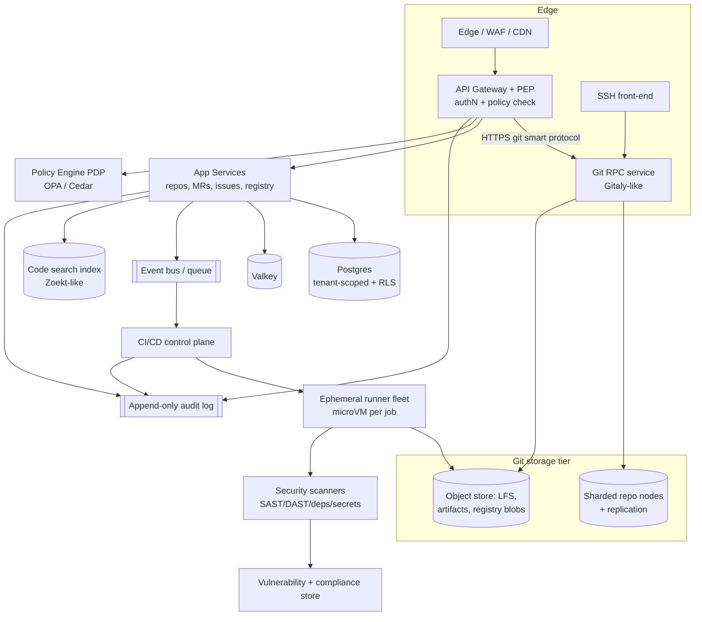

# Git SaaS — System Design

> **📌 Source of Truth:** The authoritative record of these decisions is the ADR log in
> [`docs/adr/`](../adr/README.md). Where this document and an **Accepted ADR** disagree,
> **the ADR wins** — this doc is narrative context; the ADRs are the decisions.

### Multi-tenant • GitLab-Ultimate-class features • GitHub-class UX • flat-rate pricing
### Designed with a Governance-Driven (GDD) lens

> **Why GDD fits perfectly here:** in a Git platform, governance is *two things at once* —
> (1) your own operating discipline (tenant isolation, cost control, compliance), and
> (2) your **flagship product feature** (audit logs, approval policies, security scanning,
> compliance frameworks). GitLab *Ultimate*'s whole premium value is governance. So we
> design the platform and the product from one governance model.

---

## 0. Assumptions (stated, since you gave a tight brief)
- **Tenant = organization/workspace**; users belong to one or more orgs.
- **Feature target:** repos, MR/PR review, issues/boards, CI/CD, package + container
  registry, DevSecOps scanners, compliance/audit, SSO/SCIM, code search.
- **UX target:** GitHub-style — fast, clean, keyboard-first, opinionated defaults.
- **Pricing:** flat per-org tiers (not per-seat), which forces a **cost-governance** design.
- **Deploy:** cloud-native on Kubernetes, multi-region capable (for data residency).

> **Reality check (honest):** GitLab Ultimate is ~15 years and thousands of engineer-years.
> "Build it all at once" isn't feasible. §11 gives a phased MVP → parity roadmap so this
> is a real plan, not a wish list.

---

## 1. Step 1 (GDD) — the governance model, written first

| ID | Governance objective | Also a product feature? |
|----|----------------------|--------------------------|
| G1 | **Tenant isolation** — no cross-tenant data or compute leakage | internal |
| G2 | **Least-privilege access** — RBAC + fine-grained scopes/tokens | both |
| G3 | **Supply-chain security** — SAST/DAST/deps/secrets/containers | **product** |
| G4 | **Change governance** — protected branches, approval policies as code | **product** |
| G5 | **Auditability** — immutable audit trail of every sensitive action | **product** |
| G6 | **Compliance frameworks** — SOC2/ISO/HIPAA controls + evidence | **product** |
| G7 | **Data residency** — pin tenant data/compute to a region | both |
| G8 | **Cost governance** — fair-use quotas so flat-rate stays solvent | internal |

Everything in the architecture traces back to one of these. G8 is the one most Git-SaaS
plans forget — and it's what makes flat-rate survivable (see §7).

---

## 2. High-level architecture



Tiers: **edge → app → git-storage → CI/scanning → data/platform**, with a **policy engine**
and **audit log** cutting across all of them.

---

## 3. The hard parts (where the real engineering is)

### 3.1 Git storage tier — don't let app servers touch disk
- Put a **Git RPC service** (GitLab calls theirs *Gitaly*) in front of storage so app
  servers never touch the filesystem directly. This is what lets you **shard repos**
  across storage nodes and scale horizontally.
- A **router/metadata service** maps `repo_id → storage node`.
- **HA/replication:** replicate each repo to N nodes with a consensus/failover layer
  (GitLab's *Praefect* + Gitaly Cluster pattern). Repos are stateful — this is the
  trickiest reliability problem.
- **Large files & artifacts:** Git LFS + CI artifacts + registry blobs all go to
  **object storage (S3-compatible)**, not repo nodes.
- **Transport:** smart-HTTP over the gateway *and* an SSH front-end, both terminating
  into the Git RPC service.

### 3.2 Multi-tenancy & isolation (G1)
- **Data:** shared Postgres with **`tenant_id` on every row + row-level security**;
  promote very large/regulated tenants to dedicated DBs/clusters ("cell" model).
- **Repos:** namespaced per tenant on storage; the router enforces tenant scope.
- **Compute:** CI jobs run in **per-job isolation** (next section) — never a shared runner
  executing two tenants' code in one sandbox.
- **Defense in depth:** RLS *and* a PDP check — a bug in one shouldn't breach isolation.

### 3.3 CI/CD — the expensive, dangerous part
Runners execute **arbitrary untrusted user code**, so isolation is a security boundary,
not a nicety.
- **One ephemeral sandbox per job**, destroyed after: **Firecracker microVMs**, **gVisor**,
  or **Kata Containers** — VM-grade isolation, not plain shared containers.
- **Autoscaling fleet** driven by a job queue; scale to zero when idle.
- **Caches & artifacts** in object storage; content-addressed to dedupe.
- This tier is your **#1 cost center and #1 abuse target** — see §7.

### 3.4 DevSecOps suite — the "Ultimate" differentiator (G3)
Run scanners as pipeline stages and aggregate results:
- **SAST** (code), **DAST** (running app), **dependency/SCA** scanning, **secret
  detection**, **container image scanning**, **IaC scanning**, **license compliance**.
- Normalize findings into a **single vulnerability store** with dedup, triage state,
  and a **unified security dashboard** (this is where you can beat GitLab's fragmented UX).
- **Security policies as code:** "block merge if critical vuln", "require 2 approvals for
  prod branch" — enforced by the policy engine, not tribal knowledge.

### 3.5 Governance / policy engine (G2, G4, G6)
- **PDP** (Open Policy Agent / Cedar) evaluated at the gateway and in CI admission.
- **Policy-as-code repo** owns approval rules, protected-branch rules, compliance
  controls — versioned, reviewed, deployed as bundles. Deny-by-default.
- **Compliance frameworks:** map controls (SOC2/ISO/HIPAA) → evidence pulled from the
  audit log; one-click **evidence export** for auditors.

### 3.6 Audit & search
- **Audit log:** append-only, tamper-evident (hash-chained), no delete path, separate
  from ops logs. It's a product feature *and* your compliance backbone (G5).
- **Code search:** a dedicated index (**Zoekt**-style trigram index) — full-text search
  over code at scale is its own subsystem; don't try to do it in Postgres.

### 3.7 Identity (G2, G7)
- SSO via **SAML/OIDC**, **SCIM** provisioning, per-tenant IdP config.
- Token zoo done right: PATs (scoped, expiring), deploy keys, OAuth apps, CI job tokens.
- RBAC + fine-grained permissions; region pinned per tenant for **residency (G7)**.

---

## 4. ⚠️ The flat-rate problem — and how the design solves it

**The trap:** flat price + unmetered CI compute, storage, egress, and registry = you lose
money on power users, and **crypto-miners will abuse cheap CI within days** (a well-known,
recurring problem for every CI provider). Per-seat pricing exists precisely to cover this
variable cost.

**How to make flat-rate survivable (this is G8, cost-governance-as-design):**
1. **Flat *price*, governed *envelope*.** Each tier includes a generous **fair-use**
   allotment of CI-minutes / storage / egress. Past it, you **throttle/queue**, not
   surprise-bill — so the *price* stays flat while the *cost* stays bounded.
2. **BYO-runner / BYO-storage option.** Let tenants attach their own compute and object
   storage. This offloads your two worst cost centers and is a genuine selling point.
3. **Abuse detection as a first-class subsystem.** Fingerprint mining/DDoS workloads,
   ephemeral-signup abuse, and auto-suspend. Treat it like fraud, because it is.
4. **Tier by *value*, not seats:** e.g. flat/org tiers gated on features (advanced
   security, compliance, residency, SSO) + fair-use scale — enterprises happily pay flat
   for predictability.
5. **Scale-to-zero everything** (runners, preview envs) so idle tenants cost ~nothing.

> Net: "flat rate" is a great *marketing* promise **only if** cost-governance is in the
> architecture from day one. That's why G8 is in the governance model, not an afterthought.

---

## 5. UI/UX — "GitHub-clean, not GitLab-dense"
GitHub's edge is restraint; GitLab's weakness is surface-area sprawl. Principles:
- **Speed first:** sub-100ms interactions, optimistic UI, instant navigation.
- **Keyboard-first:** command palette (⌘K), full keyboard nav, fast file/PR jumps.
- **Progressive disclosure:** power features exist but don't crowd the default view.
- **One unified security/compliance surface** instead of scattered tabs (your wedge).
- **Sane defaults:** great out-of-box CI templates, protected-branch defaults, scanners on.
- **Design system:** component library + tokens; treat empty states and diffs as
  first-class screens (that's where devs live).

---

## 6. Data model sketch (governance metadata is mandatory)
```
tenant(id, name, region, plan_tier, fair_use_budget, residency)
user(id, ...) ── membership(user_id, tenant_id, role)
project(id, tenant_id, visibility, default_branch, compliance_framework)
repo(id, project_id, storage_node, replicas)
pipeline(id, project_id, status, minutes_used)     -- feeds cost governance
finding(id, project_id, scanner, severity, state)  -- security dashboard
policy(id, tenant_id, kind, rego_ref, version)     -- policy-as-code
audit_event(id, tenant_id, actor, action, ts, prev_hash)  -- append-only
```

---

## 7. Suggested tech stack (swap freely)
- **Git RPC:** Gitaly-style service (Go) over sharded storage; Praefect-style replication.
- **App/API:** your choice (Go / Elixir / Rails-style) — GitLab is Rails, GitHub is Rails+Go.
- **Policy:** Open Policy Agent (Rego) or Cedar.
- **CI isolation:** Firecracker / Kata / gVisor; queue on the event bus.
- **Data:** PostgreSQL 18 (partitioned + RLS), Valkey, object storage (S3-compatible). (Valkey replaced Redis — ADR-0023.)
- **Search:** Zoekt-style code index.
- **Platform:** Kubernetes + autoscaling; multi-region for residency.
- **Edge:** WAF + CDN; SSH front-end for git-over-SSH.

---

## 8. Phased roadmap (build it in this order)

| Phase | Scope | Goal |
|-------|-------|------|
| **MVP** | Repos + git push/pull, MRs/PRs, issues, basic CI, auth, tenant isolation | A usable GitHub-lite |
| **v1** | Container/package registry, code search, SSO/SCIM, protected branches | Team-ready |
| **v2 (Ultimate wedge)** | Security scanners + unified dashboard, policy-as-code, audit log | The differentiator |
| **v3** | Compliance frameworks + evidence export, residency, BYO-runner, abuse defense | Enterprise + solvent flat-rate |

Ship MVP fast; your **defensible value** is the v2 unified security/governance UX — lead marketing with that, not with "another Git host."

---

## 9. Top risks & tradeoffs
- **Git storage HA** is the hardest reliability problem — repos are stateful; get
  replication/failover right early.
- **CI cost/abuse** can sink the business — §4 is non-optional.
- **Scope** — resist building all of Ultimate at once; the roadmap is the plan.
- **Search & scanning at scale** are each their own subsystem; budget for them.
- **Trust/security** — you're hosting customers' source + running their code; a single
  isolation bug is existential. Isolation (G1) gets defense-in-depth.

---

## 10. Next steps I can do for you
- Turn any one box (e.g. **CI runner isolation**, **Git storage tier**, **flat-rate
  cost model**) into a detailed low-level design.
- Build a **flat-rate unit-economics model** (spreadsheet) so you can price tiers against
  real CI/storage/egress costs.
- Draft the **MVP architecture + tech-stack decision doc**, or a pitch-deck version.

_Tell me which piece to drill into and I'll go deep._
