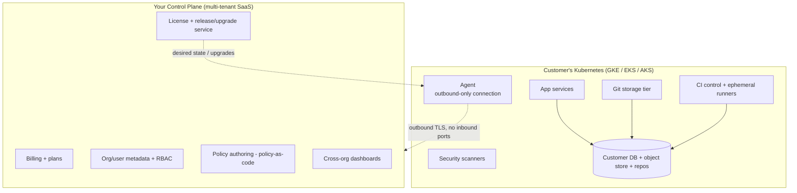

# Git SaaS — BYO-Infrastructure Deployment (GKE / EKS / AKS)

> **📌 Source of Truth:** The authoritative record of these decisions is the ADR log in
> [`docs/adr/`](../adr/README.md). Where this document and an **Accepted ADR** disagree,
> **the ADR wins** — this doc is narrative context; the ADRs are the decisions.

### Companion to the main system design • governance-driven

> **The big shift:** instead of you hosting all the expensive, stateful, risky bits,
> the **customer brings their own Kubernetes cluster** (GKE, EKS, or AKS) and runs the
> heavy **data plane** there. You run a slim multi-tenant **control plane**.
>
> Two payoffs, both connecting to earlier docs:
> - **Fixes the flat-rate economics** (§4 of the main design): the customer pays their
>   own cloud bill for CI compute, storage, and egress — your scary variable costs move
>   off your books, so **flat-rate licensing becomes genuinely safe**.
> - **Governance win:** source code + data never leave the customer's cloud → data
>   **residency (G7)**, **isolation (G1)**, and **compliance (G6)** are largely solved by
>   architecture, plus you can offer **customer-managed keys (BYOK)**.

---

## 1. Three deployment topologies (offer all; lead with B)

| | **C — BYO-runner (on-ramp)** | **B — BYOC hybrid (recommended)** | **A — Fully self-managed** |
|---|---|---|---|
| You host | everything except runners | slim control plane | nothing |
| Customer hosts (K8s) | CI runners only | full data plane (repos, CI, registry, scanners) | **everything** |
| Data leaves customer cloud? | yes (repos on your side) | **no** (only metadata/telemetry) | no |
| Best for | quick adoption, cost relief | enterprises wanting residency + SaaS convenience | air-gapped / highest-compliance |
| Complexity for you | low | medium | high (support burden) |

**Recommendation:** ship **C** first (easy, immediate cost + trust win), make **B** the
flagship, keep **A** for regulated/air-gapped buyers.

---

## 2. Control-plane / data-plane split (Topology B)



**Key pattern — the outbound-only agent.** The customer installs a lightweight **agent**
that opens an **outbound** connection to your control plane (no inbound firewall holes,
no exposing their cluster). It:
- registers the cluster and reports health/telemetry (not source code),
- pulls **desired state** (which components/versions to run) and applies it,
- streams **metadata** needed for billing/dashboards only.

Repos, build artifacts, and secrets **stay in the customer's cluster**.

**Nice simplification:** because a customer's data-plane cluster runs only *their* org's
workloads, the data plane is effectively **single-tenant** — the hard multi-tenant CI
isolation problem shrinks, and multi-tenancy lives only in your slim control plane.

---

## 3. The portability layer (the real work)

One **Helm chart + Operator** must run cleanly on all three clouds despite different
primitives. Abstract each capability behind an interface with per-cloud drivers:

| Capability | GKE | EKS | AKS | Portable approach |
|---|---|---|---|---|
| Object storage | GCS | S3 | Azure Blob | S3-compatible interface; per-cloud driver (Blob isn't S3-native → adapter) |
| Managed Postgres | Cloud SQL | RDS / Aurora | Azure DB for PostgreSQL | let customer point to managed DB, **or** run in-cluster via CloudNativePG |
| Block storage (PV) | pd-ssd | gp3 | managed-premium | `StorageClass` abstraction; fast PVCs for git nodes |
| Keyless pod→cloud auth | Workload Identity | IRSA / Pod Identity | Entra Workload ID | all OIDC-federation; one abstraction, 3 configs |
| Secrets / KMS (BYOK) | Cloud KMS | AWS KMS | Key Vault | External Secrets Operator + customer-managed keys |
| Ingress / LB | GKE Ingress | ALB | Azure LB / AGIC | **Gateway API** or nginx ingress for portability |
| Autoscaling | node auto-provisioning | Karpenter / CA | Cluster Autoscaler | Cluster Autoscaler everywhere + **KEDA** for runner bursts |
| DNS + TLS | — | — | — | cert-manager + external-dns (cloud-agnostic) |

Rule of thumb: **depend on Kubernetes APIs, not cloud APIs**, wherever possible; isolate
the unavoidable cloud-specific bits behind small drivers.

---

## 4. Packaging & lifecycle
- **Helm chart** for install/config; **Kubernetes Operator (CRDs)** for day-2:
  reconciliation, self-healing, and **controlled upgrades** across many customer clusters.
- **Versioned releases** the agent pulls on the customer's approval (no surprise upgrades).
- **Air-gapped mode (Topology A):** mirror images into the customer's registry + offline
  license file; Operator runs fully disconnected.

---

## 5. CI runner isolation on managed K8s (still non-negotiable)
Even single-tenant, you're running untrusted build code — isolate it:

| Option | Isolation | Portability on GKE/EKS/AKS | Note |
|---|---|---|---|
| **gVisor** (`RuntimeClass`) | userspace kernel | **best** — GKE Sandbox built-in; installable on EKS/AKS | some syscall/perf caveats |
| **Kata Containers** | lightweight VM | good, install per cluster | needs nested virt on some node pools |
| **Firecracker microVM** | strong VM | **hardest** on managed pools (needs KVM/bare-metal) | best for your own hosted fleet, not BYO |

**For BYO, default to gVisor via `RuntimeClass`** (most portable), Kata where customers
want VM-grade. Scale runners with **KEDA** + the cluster autoscaler; **scale to zero** idle.

---

## 6. How this rewrites the governance model (GDD)
BYOC turns several governance objectives from "hard engineering" into "architecture":

| Objective | Before (hosted) | With BYO on customer K8s |
|---|---|---|
| G1 isolation | per-job microVMs in shared fleet | mostly solved — single-tenant cluster |
| G6 compliance | you're in audit scope for their data | data never in your env → smaller scope |
| G7 residency | region-pin in your cloud | **customer picks region/cloud** — solved |
| BYOK/keys | you manage keys | **customer-managed keys** in their KMS |
| **G9 (new) least-privilege footprint** | n/a | agent must be provably minimal + auditable |

**New governance concern (G9):** you now run software *inside the customer's environment*.
Treat the agent as a security-sensitive foothold: least privilege, no data exfiltration
path, and give the customer **audit visibility over everything the agent does**. Publish
its RBAC and network policy so their security team can verify it.

---

## 7. How this fixes flat-rate economics (callback to main §4)
The main design flagged flat-rate as dangerous because CI/storage/egress are variable.
BYO resolves it structurally:

- **Heavy variable costs → customer's cloud bill**, not yours.
- **Your cost = slim control plane** (metadata, dashboards, billing) — predictable and low.
- So **flat per-org licensing is now safe**; keep only light fair-use on control-plane
  resources. Abuse risk (crypto-miners) also drops — it's the customer's own compute.
- Bonus sales angle: enterprises *prefer* "our data, our cloud, flat predictable license."

---

## 8. Where state lives (Topology B)
```
Customer cluster:  repos • git storage nodes • CI runners • artifacts/registry
                   object store (GCS/S3/Blob) • their Postgres • their KMS keys
Your control plane: org/user metadata • billing • policy definitions • telemetry
                    license/release catalog • cross-org rollups (no source code)
```

---

## 9. Risks & tradeoffs (honest)
- **Support/test matrix explodes:** 3 clouds × many cluster configs × versions. This is
  the #1 cost of going BYO. Invest early in a conformance test suite per cloud.
- **Upgrade orchestration** across fleets of customer clusters at different versions.
- **Reduced observability** into failures you can't see directly → lean on agent telemetry.
- **Agent trust** is existential — it's code in someone's infra; keep it minimal + audited.
- **Slower feature velocity** than pure SaaS (lowest-common-denominator across clouds).
- **microVM limits** on managed node pools → gVisor is the pragmatic default.

---

## 10. Updated roadmap slot-in
- **v1.5:** Topology **C** (BYO-runner) — quick cost relief + trust, minimal new surface.
- **v3:** Topology **B** (full BYOC) — the flagship; Helm + Operator + portability layer.
- **v4:** Topology **A** (air-gapped self-managed) for regulated buyers.

---

## 11. Next steps I can do
- **Design the agent + control-plane protocol** (registration, desired-state, telemetry,
  outbound-only security model) in detail.
- **Write the Operator CRD spec + Helm values** for a portable install.
- **Build the multi-cloud conformance matrix** (concrete storage/identity/ingress configs
  per GKE/EKS/AKS) as a checklist.
- **Redo the flat-rate unit economics** now that the data plane is customer-funded.

_Say which and I'll go deep._
