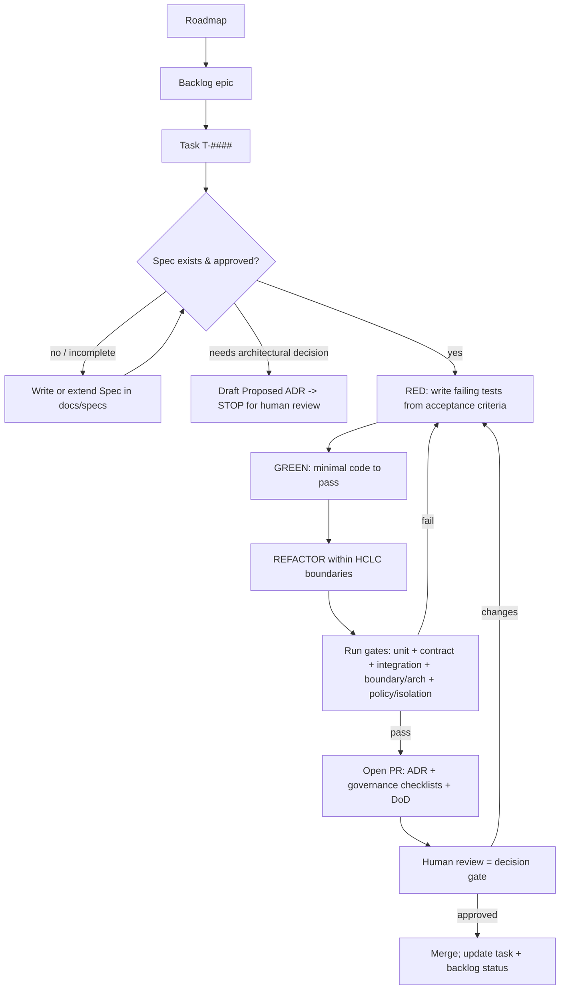

# Agentic SDLC — how work gets done

Every unit of work is a **task** (`../tasks/T-####.md`) executed **spec-first** and
**test-first**, bounded by the **ADRs** (SOT) and the **invariants**. Small PRs; the human
review is the decision gate.

## The loop

## Roles (may be one agent or several)
- **Planner** — turns roadmap/backlog into tasks + specs; flags needed ADRs.
- **Implementer** — runs RED→GREEN→REFACTOR for a task.
- **Reviewer** — checks invariants, DoD, and contract/boundary compliance in the PR.

## Stop-and-ask triggers (do NOT decide silently)
- A significant architectural choice no ADR covers → draft a **Proposed** ADR, stop.
- A behavioral question no spec answers → write/extend the **spec**, get it approved.
- An invariant would have to be violated to proceed → stop and raise it.
- A parked decision (see backlog) is required → stop.

## Artifacts touched per step
spec (`docs/specs`) → tests → code (`contexts/…` per ADR-0022 layout) → contracts (if a
boundary changes) → task status + backlog → PR.

## CI gates (must be green to merge)
unit (domain), contract (proto/events), integration (adapters), **boundary/arch tests**
(invariants 14–18), **policy + tenant-isolation tests** (invariants 1–4), version-floor
check (ADR-0023), lint/format. See `definition-of-done.md`.
